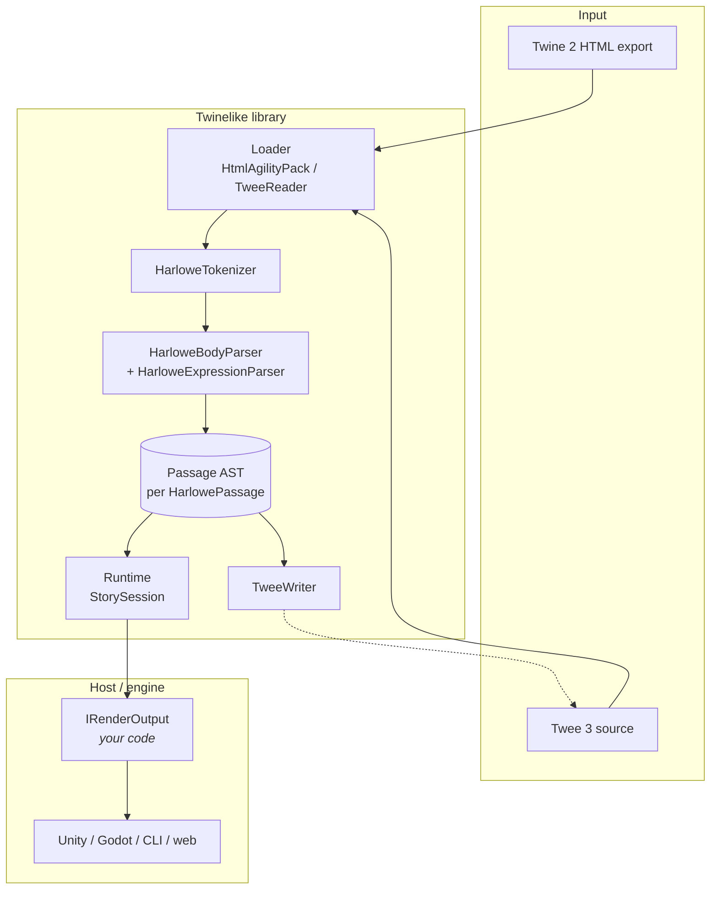
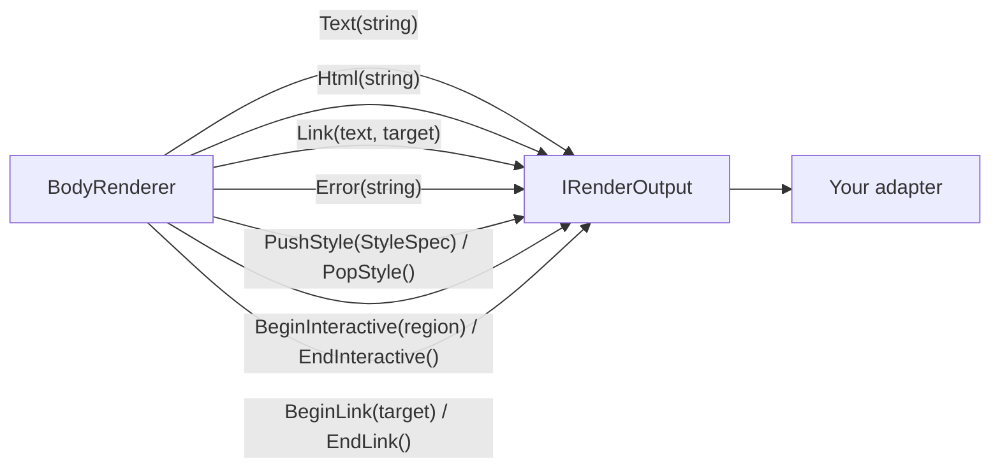
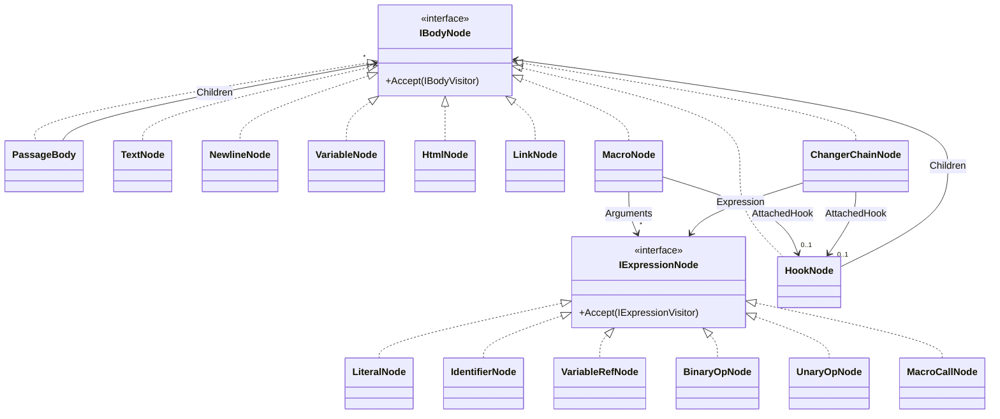
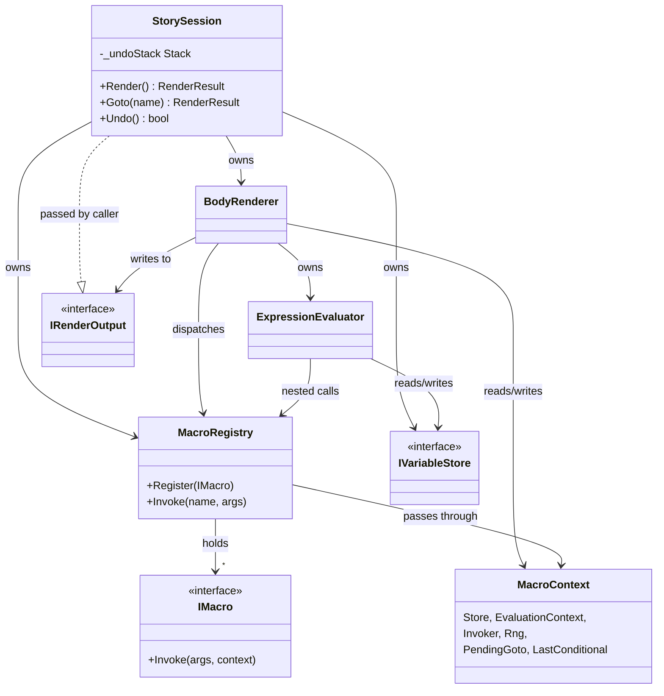
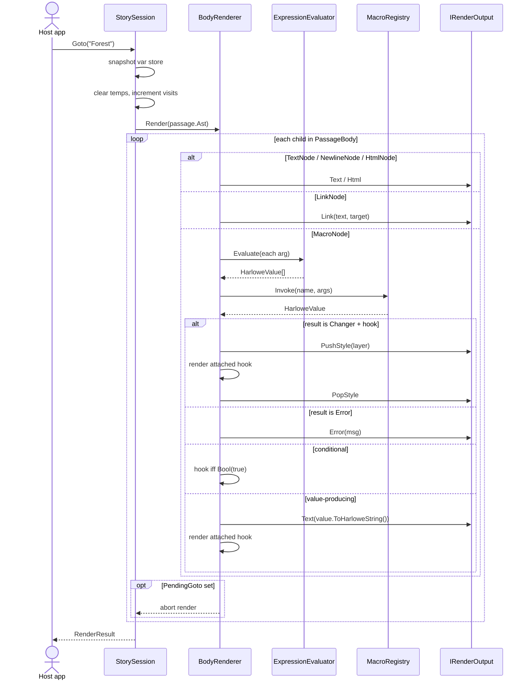
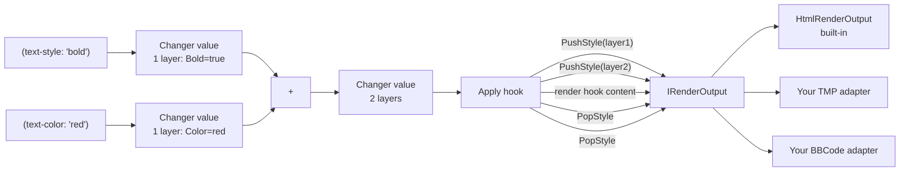

# Architecture

Companion to `CLAUDE.md` (which targets contributors and lists current state). This doc is split into two parts: **Part 1** is for game-engine integrators consuming the library, **Part 2** is for contributors working inside it.

A glossary at the end defines Harlowe-specific terms.

---

## Top-level pipeline



A story enters from one of two formats, gets parsed once into a passage AST, then gets *executed* on demand by the runtime — emitting events through your `IRenderOutput` adapter for the host engine to render. Twee 3 is the only output format (HTML emit is out of scope; Twine 2 is the natural HTML producer).

---

# Part 1 — Using the library

## Entry points

```csharp
// Load a story
var story = new Harlowe(htmlText);                 // Twine 2 HTML export
var story = new TweeReader().Read(tweeText);       // Twee 3 source

// Inspect / edit
foreach (var p in story.Passages) { ... }
story.AddPassage(new HarlowePassage { Name = "Foo", Body = "..." });
story.RenamePassage("Old", "New");

// Run it
var session = new StorySession(story, output);     // output is your IRenderOutput
var result = session.Render();                     // first passage
result = session.Goto("PassageName");
session.Undo();

// Save it back
string twee = new TweeWriter().Write(story);
```

`StorySession` is the surface most consumers want. `Harlowe` itself is the static story model (passages + metadata); the session adds runtime state (current passage, variable store, undo stack, visit counts).

## The IRenderOutput contract

`StorySession.Render()` and `Goto()` push events through an `IRenderOutput` you supply. Ten channels — four flat, three bracket pairs:



| Channel | What it carries | When emitted |
|---|---|---|
| `Text` | Plain prose | Always |
| `Html` | Raw author HTML in passage source | When the author writes literal `<b>foo</b>` |
| `Link` | Text + target passage name | For `[[passage]]` links whose label is plain prose (the common case) |
| `Error` | Inline error message | Failed expression / unknown macro / arity mismatch |
| `PushStyle` / `PopStyle` | `StyleSpec` (semantic styling layer) | Changer macros entering / leaving scope |
| `BeginInteractive` / `EndInteractive` | `InteractiveRegion` (id + kind) | Click/hover macros arming a region — report the user's event back via `StorySession.DispatchEvent(regionId)` |
| `BeginLink` / `EndLink` | Target passage name | Instead of `Link` when a link's label carries structure (styles or armed regions, e.g. after `(replace: ?link)[''bold'']`) — the label arrives as ordinary events in between; render both shapes as the same navigable link |

**Style is semantic, not HTML.** A `StyleSpec` describes one styling layer with named flags (`Bold`/`Italic`/`Underline`/`Strikethrough`) and value fields (`Color`/`BackgroundColor`/`FontFamily`/`FontSize`). You map it to whatever your renderer accepts — TextMeshPro tags for Unity, BBCode for Godot, ANSI for a terminal, HTML for a browser. The library never bakes in HTML.

For browser hosts, `HtmlRenderOutput` is a built-in adapter that wraps an inner `IRenderOutput` and translates style events to HTML on the way through. Use it as a reference impl if you're writing your own:

```csharp
var inner = new MyTmpRenderOutput();        // your engine adapter
var session = new StorySession(story, inner);
```

## Errors are in-prose, never thrown

A bad expression (`(set: $x to "five" * 2)`, unknown macro, type mismatch) produces an `Error` event at the point it happened. The rest of the passage continues to render. No `try/catch` needed around `Render()` / `Goto()` for runtime errors — only parse-time failures throw `HarloweParseException`.

```
[story prose]      Text("You see ")
[bad expression]   Error("$missing is not set")
[continues]        Text(", and the door creaks.")
```

Engines decide what to do with errors — render them inline in red, log to console, silence in production builds.

## Variables and undo

Two namespaces: **story-scoped** (`$foo`, persists across passages) and **temporary** (`_foo`, cleared on every `Goto`). The session also tracks a per-passage visit count and an "implicit it" slot for shorthand expressions.

`Goto` snapshots the variable store first; `Undo` restores it. The undo stack is unbounded — snapshots are small (var store deep copy + visit-count dict) so memory grows linearly with goto depth, fine for typical stories.

## Editing the story object model

`Harlowe` exposes mutation: `AddPassage`, `RemovePassage`, `RenamePassage` (re-keys the lookup; direct `passage.Name = "..."` mutation is a silent footgun), public setters for metadata. Edits flip `HarlowePassage.IsDirty`; `TweeWriter` uses that flag to decide whether to emit `RawBody` verbatim (clean) or re-canonicalize via `MarkupPrinter` (dirty). Cross-tool diffs through Twee stay scoped to actually-edited passages.

---

# Part 2 — Internal architecture

## Two-layer parsing

```
Layer 1 — Host                                    Layer 2 — Harlowe markup
─────────────────                                ──────────────────────────────
HTML  → HtmlAgilityPack → tw-passagedata bodies ─┐
                                                  ├──► HarloweTokenizer ─► Tokens
Twee  → TweeReader      → :: header bodies      ─┘                         │
                                                                            ▼
                                                                  HarloweBodyParser
                                                                            │
                                                                            ▼
                                                              (delegates macro args to)
                                                                            │
                                                                            ▼
                                                              HarloweExpressionParser
                                                                            │
                                                                            ▼
                                                                     PassageBody AST
```

Layer 1 has two front-ends; Layer 2 is shared. Both front-ends populate `HarlowePassage.RawBody` so the writer can emit clean passages byte-for-byte. The HTML front-end uses `HtmlEntity.DeEntitize` so `->`/`<-`/quotes reach the tokenizer unencoded; the Twee front-end synthesizes sequential pids since Twee has no pid concept.

## Tokenizer modes

The tokenizer maintains a stack of frames with a per-frame paren depth so `)` can be disambiguated as `ParenClose` (inside an expression group) vs `MacroClose` (ends a macro). A separate `_inLink` flag suppresses macro/hook markup inside `[[…]]`.

```
   Body                       Expression
  ┌──────────────┐    "("    ┌──────────────────┐
  │ prose tokens │ ────────► │ operator/literal │
  │ macros, [    │ ◄──────── │ tokens, parens   │
  │ links [[     │    ")"    └──────────────────┘
  └──┬───────────┘
     │ "[[" sets _inLink (suppresses macro/hook recognition until "]]")
     ▼
   Link
```

Multi-word operators (`is not`, `is in`, `does not contain`) fuse at lex time. The whitespace-sensitive `'s`, digit-leading `2bind`, ordinal indices (`1st`/`Nthlast`), and `-type` TypedVar suffix are all scanned in dedicated passes.

## Two AST trees

Same `(name: ...)` syntax means different things in body position vs. argument position, so the AST splits.



- **Body nodes** describe rendered prose: text, hooks, links, macros that *do something* in body position (`(if:)`, `(set:)`, `(for:)`).
- **Expression nodes** describe macro arguments: literals, operators, nested calls.
- A macro in body position is `MacroNode`; the same syntax in an arg list is `MacroCallNode`. Different lifecycle, different visitor.
- `ChangerChainNode` covers two folded shapes: inline composition `(m1)+(m2)[hook]` and stored-changer-then-hook `$var[hook]`.

Both trees use the visitor pattern. Adding a new node type means a `Visit(NewNode)` method on its visitor interface, which forces every existing visitor to acknowledge it (compile-time enforcement, no missing-case bugs).

## Visitor implementations

| Visitor | Tree | Purpose |
|---|---|---|
| `BodyRenderer` | Body | Drives `IRenderOutput` events during a passage render |
| `ExpressionEvaluator` | Expression | Reduces a tree to one `HarloweValue` |
| `MarkupPrinter` | Both | Canonical Harlowe-source emission for Twee write-out |
| `BranchCollector` (internal) | Body | Derives `HarlowePassage.Branches` from `LinkNode`s |

`BranchCollector` lives in `BodyVisitors.cs` (deduplicated from earlier per-loader copies). When a new body node lands, every `IBodyVisitor` implementation needs a `Visit` override — usually a no-op or a recurse-into-children.

## Runtime composition



`MacroContext` is the per-render bag of state that crosses between the renderer, evaluator, and macros. Carries the variable store, RNG (seedable for deterministic tests), passage-render callback (for `(display:)`), and two short-lived flags:

- **`PendingGoto`** — `(goto:)` writes here; the renderer checks before each sibling and aborts mid-passage to follow the goto.
- **`LastConditional`** — the conditional pairing flag (reference's `lastHookShown`). Written only by `BodyRenderer` at hook-application time: a shown attached hook (changer or boolean) sets true; a hide sets false only for attached booleans and expressions fronted by `if`/`unless`/`else` (an `(else-if:)` hide, or one from a stored changer in a variable, preserves the prior value). `(else:)`/`(else-if:)` read it at call time to bake their decision.

## Render sequence



## Changer pipeline

Changers are values with a list of styling layers. The `+` operator composes them outer-to-inner; applying one to a hook brackets the hook in `PushStyle`/`PopStyle` events.



The library never assumes HTML. Engine integrations consume `PushStyle(StyleSpec)`/`PopStyle()` and translate to whatever shape their text renderer wants.

## HarloweValue tagged union

| Kind | Raw payload | Notes |
|---|---|---|
| `Number` | `double` | Invariant culture for `ToHarloweString`. |
| `String` | `string` | |
| `Bool` | `bool` | The only truthy kind; everything else is falsy regardless of contents. |
| `Array` | `List<HarloweValue>` | Deep-copied by the variable store on snapshot. |
| `Datamap` | `Dictionary<string, HarloweValue>` | Same. |
| `Dataset` | (deferred) | Not yet runtime-evaluated. |
| `Changer` | `Changer` instance | Empty `ToHarloweString` so `(print:)` doesn't dump internals. |
| `Error` | `string` (message) | Short-circuits every operator; surfaces through `IRenderOutput.Error`. |

Equality is structural and recurses into arrays + datamaps. Errors propagate through every operator handler — the runtime hot path has no `try/catch`.

## Where to add things (contributor cheatsheet)

| Adding... | Touches |
|---|---|
| **A new value-producing macro** (e.g., `(upper:)`) | Subclass `IMacro` in `Runtime/Macros/`, register in `StandardMacros.RegisterAll`. |
| **A new changer macro** (e.g., `(text-color:)`) | Same, but return a `Changer.FromStyle(new StyleSpec { Color = ... })`. Engine integrations decide rendering. |
| **A new `HarloweValue` kind** | Extend `HarloweValueKind` enum, add factory + accessor on `HarloweValue`, update `Equals`/`GetHashCode`/`ToHarloweString`/`IsTruthy`. |
| **A new body AST node** | Add the class under `Ast/Body/`, add `Visit` to `IBodyVisitor`, implement on every visitor (`BodyRenderer`, `MarkupPrinter`, `BranchCollector`). Body parser needs a recognizer. |
| **A new expression AST node** | Same, against `IExpressionVisitor` (only `ExpressionEvaluator` and `MarkupPrinter`). |
| **A new operator** | Add to `WordOperators` (or scanner) in `HarloweTokenizer`, add precedence entry to `HarloweExpressionParser.BinaryOps` / `UnaryPrefixOps`, handle in `ExpressionEvaluator.Visit(BinaryOpNode/UnaryOpNode)`, mirror precedence in `MarkupPrinter`. |
| **A new render channel** | Add to `IRenderOutput`, implement on `BufferedRenderOutput` + `HtmlRenderOutput`, emit from wherever produces it. |

The visitor pattern's compile-time exhaustiveness is the safety net — adding a node type without updating every visitor is a build error, not a runtime surprise.

---

## Glossary

| Term | Meaning |
|---|---|
| **Passage** | A unit of content in a Twine story — typically a scene, a screen, or a node in a branching narrative. Identified by name. |
| **Hook** | A `[bracketed]` region of body content. Optionally named (`|name>[content]` or `[content]<name|`) for later targeting. Macros can attach to a hook to wrap or transform it. |
| **Link** | `[[display->target]]` — a passage-to-passage navigation. Three forms: `[[name]]` (self-targeting), `[[text->target]]`, `[[target<-text]]` (right-pointing canonical). |
| **Macro** | `(name: args...)` — Harlowe's function-call syntax. Acts as a command (`(set:)`, `(goto:)`), value producer (`(random:)`, `(a:)`), or changer (`(text-style:)`). |
| **Changer** | A value that wraps an attached hook in styling or behavior. Composes via `+`. Engine consumes as semantic events; built-in `HtmlRenderOutput` translates to HTML for the web. |
| **Lambda** | `_x where _x > 5` — a parameter binding with optional clauses (`where`/`via`/`making`/`each`; `when` deferred). Consumed by collection macros (`(find:)`, `(altered:)`, `(folded:)`, `(for:)`, etc.). |
| **TypedVar** | `num-type _x` — a typed parameter binding. The `-type` suffix is recognized at lex time. |
| **Story variable** | `$foo` — persists across passages, snapshotted by `Goto` for undo. |
| **Temp variable** | `_foo` — cleared at every `Goto`. |
| **`it`** | Implicit slot updated on every `Set`. Lets shorthand expressions like `$x to it + 1` work. |
| **Twee** | Plain-text source format for Twine stories. Single file, `:: PassageName` headers at column 0. Git-friendly alternative to the HTML export. |
| **StoryData** | Special Twee passage carrying story-level metadata as JSON (`ifid`, `format`, `start`, etc.). |
| **`(goto:)` redirect** | Setting `MacroContext.PendingGoto` aborts the current render and follows the redirect. The session caps consecutive redirects at `MaxGotoDepth` to avoid loops. |
| **In-prose error** | A failed expression renders inline through `IRenderOutput.Error` rather than throwing. The rest of the passage continues. |
